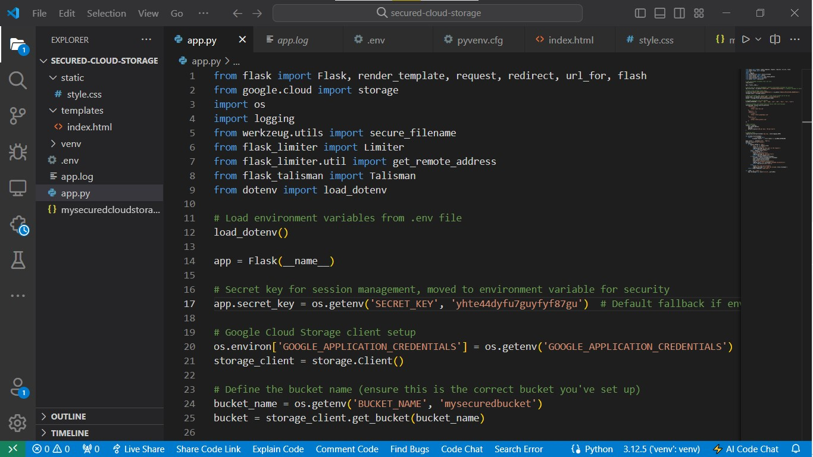

*Secured Cloud Storage Application*

## *Overview*
The Secured Cloud Storage Application is a web-based platform designed to securely store files in Google Cloud Storage. This project demonstrates robust cloud security measures, emphasizing secure file handling, access management, and encryption, along with a vulnerability assessment to identify potential security gaps and outline mitigation strategies.

## *Table of Contents*
1. 1. Project Description
2. Key Features
3. Technology Stack
4. Installation Guide
5. Configuration and Setup
6. Security Features
7. Vulnerability Assessment and Findings
8. Action Plan for Mitigation
9. Usage Instructions
10. Screenshots
11. Testing and Validation
12. Troubleshooting
13. Conclusion
14. References

## *1. Project Description*
The Secured Cloud Storage Application provides a secure environment for file storage, supporting multiple file types, performing strict validation, and managing access through secure service accounts and IAM roles. This project showcases practical skills in cloud security, focusing on encryption, access control, and secure coding practices. Additionally, a comprehensive vulnerability assessment was conducted to ensure the application’s security resilience

## *2. Key Features*
- *Secure File Uploads*: Allows secure uploads of various file types with validation checks to prevent malicious content.
- *Access Management*: Uses Google Cloud IAM roles to manage permissions, ensuring access control is enforced at all times.
- *Data Encryption*: Files are encrypted at rest and in transit, protecting data integrity and confidentiality.
- *Rate Limiting*: Implements rate limiting to prevent abuse and mitigate denial-of-service attacks.
- *Content Security Policy (CSP)*: Mitigates cross-site scripting (XSS) and other code injection attacks.

## *3. Technology Stack*
- *Backend*: Flask
- *Cloud Provider*: Google Cloud Platform (GCP)
- *Security Libraries*: Flask-Talisman, Flask-Limiter
- *Languages*: Python, HTML, CSS, JavaScript
- *Vulnerability*:Owasp Zap
- *Version Control*: Git, GitHub

## *4. Installation Guide*
### Prerequisites
- Python 3.8 or higher
- Google Cloud account with project set up
- Git

### Steps
1. *Clone the Repository*
   bash
   git clone https://github.com/yourusername/secured-cloud-storage.git
   
2. *Create a Virtual Environment*
   bash
   python -m venv venv
   source venv/bin/activate   # On Windows: venv\Scripts\activate
   
3. *Install Dependencies*
   bash
   pip install -r requirements.txt
   
4. *Set Up Environment Variables*
   - Create a .env file with your Google Cloud credentials and bucket information:
     
     SECRET_KEY=<your_secret_key>
     GOOGLE_APPLICATION_CREDENTIALS=<path_to_your_json_key>
     BUCKET_NAME=<your_bucket_name>

     

## *5. Configuration and Setup*
### Google Cloud Configuration
1. *Create a Cloud Storage Bucket*: Set up a bucket in Google Cloud Storage with proper access controls.

2. *Set Up Service Account*: Create a service account with Storage Admin and Storage Object Admin roles. Download the JSON key file and link it to your application.
3. *Configure IAM Roles*: Define roles with the least privilege principle to control access to your resources.

### Application Configuration
1. *Environment Variables*: Load environment variables using the .env file to securely manage credentials.

2. *Flask Configuration*: Set up Flask with secure headers and configure the application to connect with the cloud storage.

## *6. Security Features*
- *IAM Roles and Permissions*: Implements strict access control by defining and managing roles.

- *Service Account Security*: Uses a dedicated service account with the least privilege access, following best practices.

- *CSP with Flask-Talisman*: Protects against common vulnerabilities like XSS and content injection.

- *Rate Limiting with Flask-Limiter*: Limits the number of requests per user to prevent abuse.

- *Logging and Monitoring*: Logs security events and unauthorized access attempts to enhance visibility and response.

7. A vulnerability assessment was performed using OWASP ZAP to identify security weaknesses in the application. The assessment revealed the following issues:

	•	Absence of Anti-CSRF Tokens: Forms lacked CSRF protection, which could allow unauthorized actions.
	•	Server Information Leakage: The server disclosed its version information via HTTP headers, making it vulnerable to targeted attacks.
	•	Session Management Weaknesses: Identified areas for improvement in session handling to prevent unauthorized access.
	•	User Agent Fuzzer Alerts: Detected how various user agents interacted with the application, indicating potential exposure points.

Details from the ZAP Report:
The full report includes a detailed breakdown of each vulnerability, its risk level, and suggested remediations. The vulnerabilities are categorized by risk and confidence, showing a mix of medium, low, and informational risks.

	•	ZAP Report Summary:
	•	Medium Risk: Absence of Anti-CSRF Tokens
	•	Low Risk: Server Leaks Version Information
	•	Informational: Modern Web Application, Session Management Response, and User Agent Fuzzer Alerts.

For a comprehensive understanding of the vulnerabilities and recommendations, the full ZAP report is available here.
ulnerability Assessment Report
The application’s security was thoroughly tested, and the results are available in the following report:

[Read the Full Vulnerability Assessment Report](https://drive.google.com/file/d/11gXabcs-DbBMmZJyLPShSF0xA0TuhKAu/view?usp=drivesdk)

8. Action Plan for Mitigation

To address the identified vulnerabilities, the following mitigation steps have been planned:

	1.	Implement CSRF Tokens: Introduce CSRF tokens for form submissions to prevent unauthorized requests.
	2.	Hide Server Headers: Adjust server settings to obscure version information in HTTP responses.
	3.	Strengthen Session Management: Enhance session security by applying secure cookie attributes and implementing stricter session timeout policies.

## *7.1. Usage Instructions*
1. *Start the Application*
   bash
   python app.py
   
2. *Access the Web Interface*: Open http://localhost:5000 in your browser to access the application.
3. *Upload Files*: Use the file upload feature to test secure file handling. Only permitted file types will be accepted.

## *8. Screenshots*
- *Bucket Configuration*: Screenshot showing the Google Cloud Storage bucket setup.

- *IAM Configuration*: Screenshot of the IAM roles and permissions set up.

- *Web Interface*: Screenshots of the main upload page and confirmation messages.

- *Error Messages*: Screenshots showing error handling for invalid file types or unauthorized access.

- *Html, css and app.py code snippet*: 

## *9. Testing and Validation*
- *Functional Testing*: Verify all features work as expected.

- *Security Testing*: Validate that CSP, rate limiting, and other security measures effectively protect the application.

- *Integration Testing*: Test the integration with Google Cloud Storage and service accounts.

## *10. Troubleshooting*
- *Common Errors*:1. File Upload Failures

	•	Error: Files do not upload, or error messages display.
	•	Solution: Check file types against allowed extensions in the application. Verify that the service account has correct permissions for the bucket.

2. CSP Blocking Content

	•	Error: CSS or external scripts are blocked due to CSP settings.
	•	Solution: Adjust the CSP configuration in Flask-Talisman to allow required sources without compromising security.

3. Access Denied Errors

	•	Error: Access denied when attempting to view or manage files.
	•	Solution: Check IAM roles and permissions in Google Cloud. Ensure the service account used by the application has proper access rights.

4. Rate Limiting Blocks Legitimate Access

	•	Error: Users are rate limited despite valid usage patterns.
	•	Solution: Review rate limiting settings in Flask-Limiter and adjust thresholds to balance security and usability.

- *Debugging Tips*: 5. Debugging Tips

	•	Enable Debug Mode: Use Flask’s debug mode for detailed error messages during development. Avoid using it in production for security reasons.
	•	Logging: Regularly review log files (app.log) for warnings and errors to identify recurring issues.

## *11. Conclusion*
This project not only demonstrates key skills in cloud security implementation but also reflects my ability to conduct a critical assessment of vulnerabilities and develop actionable strategies to enhance the application’s security posture. The combination of proactive security measures and vulnerability assessments underscores a comprehensive approach to maintaining secure cloud environments.

## *12. References*
- [Flask Documentation](https://flask.palletsprojects.com/)
- [Google Cloud Platform Security](https://cloud.google.com/security)
- [Flask-Talisman](https://github.com/GoogleCloudPlatform/flask-talisman)
- [Flask-Limiter](https://flask-limiter.readthedocs.io/)
- [Owasp-Zap](https://owasp.org/www-project-zap/)